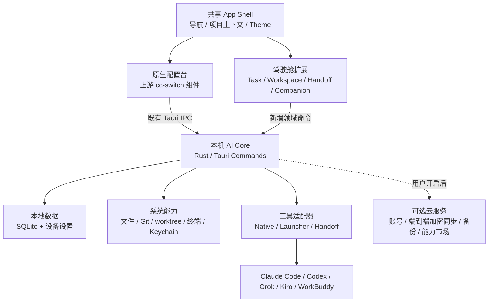
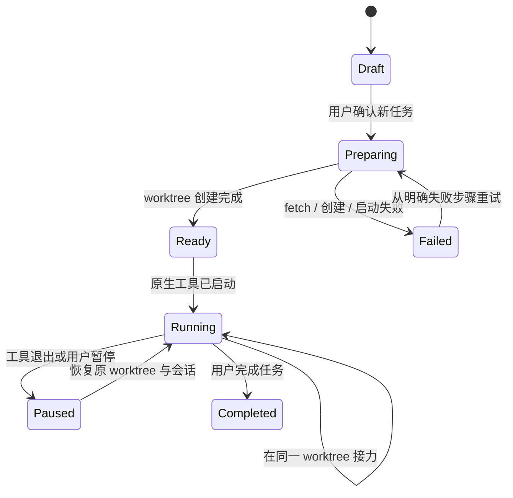
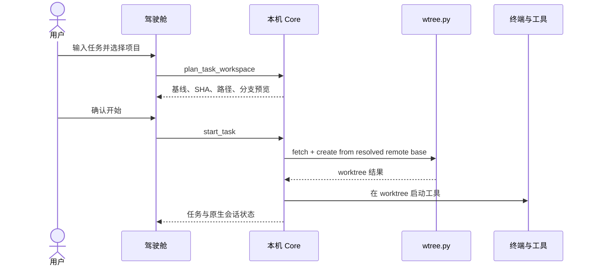

# Tandem 个人 AI 驾驶舱设计基线

## 一句话定义

Tandem 是基于 CC Switch、运行在用户电脑上的个人 AI 驾驶舱：它为每项任务准备独立工作现场，选择并启动合适的 AI 工具，让任务可以跨工具继续，并把用户确认过的工作方式沉淀为可携带的“搭子”。

“个人 AI 驾驶舱”是用户看到的产品；“个人 AI 控制层”是它在系统中的技术位置。

## 产品复审结论

方向通过产品复审，等待人类审批。复审确认以下体验红线：

- 首屏的核心对象必须是任务和工作现场，不能是模型、工具或聊天。
- “新任务”与“继续任务”必须是两条不可混淆的路径，不能用提示词模拟继续。
- 技术细节只在产生副作用前出现，用来建立信任，不把 Git 术语铺满日常界面。
- 当前任务只能表达为“在某原生工具中打开的工作现场”。Tandem 不展示虚构的执行进度，也不提供自己无法兑现的暂停控制。
- 新入口不能以“聚焦”为名删除 cc-switch 已有能力。供应商、代理、MCP、Prompts、Skills、用量、会话和同步备份仍由原生服务与数据模型承载。
- 本机 Core 是默认执行面，云端始终是可选能力；任何增长诉求都不能突破这条边界。
- 搭子的价值来自可携带且经确认的工作方式，不来自更多面板、计数器或自动生成的记忆。

## 第一阶段目标用户

Tandem 第一阶段服务“AI 项目创造者”：他们正在用 AI 创建软件、自动化或数字产品，每周使用两个及以上 AI 工具，能够描述目标和判断结果，但不愿意管理 Git、worktree、终端配置、模型协议和多工具上下文。

产品不得用“初级开发者”定义这群人。Tandem 的价值是让底层复杂度消失，而不是提醒用户缺少专业知识。

第一阶段明确不覆盖：

- 只有通用问答或纯办公聊天、没有本机项目的用户。
- 团队权限、组织用量和集中策略管理后台。
- 脱离配对本机 Core 独立执行任务的网页或移动端。
- 要求 Tandem 提供主聊天、编辑器或云端开发环境的场景。

## 用户问题

用户已经拥有 Claude Code、Codex、Grok Build、Kiro、WorkBuddy 等工具，但工作被割裂在不同入口中：

- 开始任务前，要重复选择项目、模型、凭据和终端。
- 不同工具能力与模型开放程度不同，用户很难判断该用谁。
- 切换工具时，目标、进度、约束和下一步容易丢失。
- 任务经常直接发生在主 checkout 中，并发工作相互污染。
- 个人规则、Skills 和偏好散落在各工具中，无法持续积累。

用户真正需要的不是另一个聊天或工作台，而是一个不替代现有工具的控制入口。

## 产品原则

### 工作现场先于工具

用户选择的是“我要完成什么”，而不是先选择某个 AI。Tandem 先建立或恢复任务现场，再让工具进入现场。

### 本地执行，云端可选

文件、Git、worktree、环境变量、凭据、终端和工具进程属于本机执行面。账号、加密同步、备份和能力市场可以由云端提供，但不得成为本地核心流程的前置依赖。

### 原生工具保持原生

Tandem 不承载主聊天、编辑器或执行画布。它负责启动、恢复、接力和治理；用户继续在 Claude Code、Codex、Kiro 等原生界面工作。

### 学习必须经确认

系统可以提出偏好或规则建议，但只有用户明确确认后才能写入长期搭子。一次性选择不得被推断为长期偏好。

### 副作用必须可预见

创建 worktree、启动程序、写入规则或同步数据前，界面必须展示将发生的关键变化。打开弹窗和切换选项本身不产生系统副作用。

## 产品边界

### 做什么

- 管理工具连接、模型路由、凭据状态和启动能力。
- 从远端基线创建隔离任务工作区。
- 恢复已有任务 worktree 与对应原生会话。
- 在同一任务工作区内完成跨工具接力。
- 装载个人规则、项目规则、Skills 和经确认的偏好。
- 记录任务、工作区、工具和接力的可审计关系。

### 不做什么

- 不再造一个 Cowork、聊天窗口、编辑器或 IDE。
- 不复制或转换各工具的私有完整会话历史。
- 不把本地文件、完整环境变量或明文凭据上传到云端。
- 不允许网页直接获得任意本地执行权限。
- 不在未确认时自动学习、自动删除 worktree 或替用户作高风险决定。

## 核心体验

### 首次价值时刻

第一次惊喜不是“配置导入成功”，而是用户只选择一个项目并说出目标。在正常就绪的本机环境中，Tandem 从用户确认开始，应在 10 秒内推荐合适工具、建立不会破坏原项目的独立工作现场并启动目标工具进程。任务启动后立即进入任务全局，用户可以从 Tandem 一次点击回到原生工具现场。

10 秒指标不包含首次安装、缺失依赖修复、异常网络下载或 Agent 完成任务的时间。这些情况必须显示具体步骤和可恢复状态，不能伪装成静默等待。

首次流程遵循以下顺序：

1. 只读扫描本机工具、现有 Provider、Skills、Rules 和可恢复会话索引。
2. 展示检测与可导入结果，不在扫描阶段改写 live 配置。
3. 用户选择项目并输入一个真实目标。
4. Tandem 给出一个首选工具、一个备选和一句主要理由。
5. 用户确认后才补齐必要配置、建立工作现场并启动工具。

已有官方登录可用时优先复用。TokenKey 是降低多工具配置成本的加速器，不是用户看到首次价值前的强制注册墙。配置可以直接导入；从配置推断出的习惯只能成为待确认学习提案。

### 工具推荐

Tandem 推荐，用户决定。第一阶段不自动启动推荐结果，用户可以在产生副作用前一键覆盖。

推荐策略与商业付费套餐分离，只提供三个用户可理解的模式：

- **最佳效果**：优先成功率与复杂任务能力。
- **均衡完成**：综合能力、速度和预计成本，作为默认策略。
- **节省成本**：满足任务门槛后优先低成本工具与模型。

推荐结果只展示一个首选、一个备选和一句主要理由。工具能力、预计成本、速度、当前可用性、项目历史效果和已确认偏好可以参与排序，但不得变成首页仪表盘。用户覆盖只影响当前任务；重复模式形成待确认的路由偏好后，才能进入长期搭子。

### 新任务

用户输入任务并选择项目。默认确认页只展示“从项目哪个版本开始”“是否创建独立工作现场”“是否影响原项目”“使用哪个工具和推荐策略”。远端基线、SHA、worktree 路径和分支放入折叠的技术详情。用户确认后：

1. 刷新远端引用并解析基线，默认使用 `origin/main`；不存在时由共享 worktree 引擎按受支持规则回退，并展示实际基线。
2. 通过共享 `wtree.py` 引擎创建 submodule-safe worktree。产品代码不调用面向人类交互的 `wts` 包装器。
3. 使用任务 slug 生成唯一分支和相邻目录，例如 `cc-switch-wt-handoff-ux`。
4. 在 worktree 中打开用户配置的终端并启动所选工具。
5. 通过工具适配器注入任务、项目上下文、个人规则与可用 Skills。
6. 将任务、worktree、工具会话与基线 SHA 关联存储。

主 checkout 的未提交改动不会进入新 worktree。界面默认使用“原项目中尚未保存为版本的改动不会带入新现场”，技术详情再展示 Git 原因。

日常界面只使用“项目”“独立工作现场”“版本保护”和“可恢复”。第一阶段以 Git 项目作为可靠执行边界，但不要求用户理解 Git。非 Git 项目可以导入和扫描；首次任务前必须进入独立的版本保护设置流程，不得在 `start_task` 内静默初始化仓库或提交全部文件。

### 继续任务

用户从最近任务中选择一个已有工作现场。驾驶舱验证 worktree 和原生会话仍可用，然后在原路径恢复原工具会话。

- 不刷新基线。
- 不创建新的 worktree 或分支。
- 不把“继续”转换成一条新的任务提示。
- 原生会话不可恢复时，保留同一 worktree，向用户提供在原工具中新会话继续或发起接力的明确选择。

### 跨工具接力

接力发生在当前任务的同一 worktree 中，不再创建另一个工作区。Tandem 生成标准化交接包：

- 目标与完成标准
- 已完成、待完成和当前阻塞
- 已确认决策与约束
- 相关文件与改动摘要
- 已执行的验证、结果与失败信息
- 推荐下一步
- 可携带的个人规则与 Skills 引用
- 明确排除的凭据、私有会话正文和敏感数据

交接包使用一份工具无关的结构化 SSOT，由 ToolAdapter 生成目标工具需要的提示或本地文件。交接包不包含目标工具无法合法读取的私有会话历史。目标工具通过适配器在原 worktree 中启动，并关联为该任务的新原生会话。

接力状态不得合并成一个虚假的“成功”：

- **已打开**：目标工具打开了同一工作现场。
- **上下文已送达**：目标工具成功收到标准接力包。
- **已接手**：目标工具确认目标，并开始或完成一个可验证的下一步。

只有能达到“上下文已送达”的适配器才展示“可接力”；只能启动的工具展示“只能打开”。

### 搭子学习

任务结束或重复模式出现后，系统可以生成学习提案。用户选择“保留”后写入工具无关的“个人工作方式”SSOT；选择“仅这次”只影响当前任务；忽略则不产生变化。

SSOT 中每条知识包含内容、类型、作用域、来源证据、确认状态、有效期和敏感级别。学习类型仅包括偏好、规则、可复用流程、验证方法和路由经验。项目事实与临时任务状态不得进入长期记忆。

Companion Compiler 从 SSOT 为不同工具生成 Skill、Rule、Memory、Harness 或 Prompt。派生文件不是新的事实来源；修改或删除 SSOT 条目后，所有派生载体必须同步更新或撤销，不能留下孤儿规则。

### 新设备冷启动

新用户不应该先理解每个工具的配置文件。首次启动由本机 Core 执行一次可预览、可回滚的设置流程：

1. 扫描本机已安装工具和现有 live 配置。
2. 从用户输入、受信任 Deep Link 或企业 bootstrap 中获取 TokenKey 凭据，并立即写入本机安全存储；安装包和 HTML 不包含共享明文 Key。
3. 从 TokenKey capability manifest 解析当前账号实际开放的协议、模型与端点。
4. 为每个已安装平台生成配置计划，明确使用 TokenKey、保留官方登录或保留现有供应商。
5. 在用户确认后备份现有配置，通过既有 ProviderService 和原子写入路径应用，不新建第二套写配置逻辑。
6. 逐个平台验证配置并展示结果；任一平台失败可单独重试或整体回滚。

扫描结果还应包含可导入的 Skills、Rules 和原生会话索引，但它们分别进入既有 owner，不合并成一份不可追溯的“习惯”。只读导入和现有官方登录优先于要求用户配置新的 TokenKey 凭据。

冷启动必须覆盖 cc-switch 原生管理的 Claude Code、Claude Desktop、Codex、Gemini CLI、Grok Build、OpenCode、OpenClaw 和 Hermes。TokenKey 是否能接管某个平台由实时 capability manifest 与对应适配器共同决定；不能接管时仍要导入并保留该平台的现有配置，而不是从界面消失。

Kiro 和 WorkBuddy 当前属于任务启动与接力适配器，不等同于 cc-switch 原生供应商管理平台。两类 catalog 必须分开维护。

## 原生能力继承

个人 AI 驾驶舱是在 cc-switch 上增加任务控制面，不是替换原有产品。下列能力必须继续由现有模块提供，并可从“配置”一级入口访问：

| 能力               | 保留的用户价值                                          | 既有 owner                                        |
| ------------------ | ------------------------------------------------------- | ------------------------------------------------- |
| 分平台供应商管理   | 添加、编辑、切换、导入、导出、排序和恢复官方登录        | ProviderService / provider presets                |
| 通用供应商         | 一份配置映射到支持的多个应用                            | UniversalProviderPanel / universal provider model |
| 本地代理与故障转移 | 协议转换、热切换、健康检查、熔断和应用接管              | ProxyService / failover                           |
| MCP                | 统一管理、导入导出、Deep Link 与 live 双向同步          | McpService                                        |
| Prompts            | 管理并同步 CLAUDE.md、AGENTS.md、GEMINI.md 等 live 文件 | Prompt service                                    |
| Skills             | 仓库发现、ZIP 安装、软连接/复制、备份恢复和跨应用同步   | Skills SSOT                                       |
| 用量与成本         | 请求、Token、费用、模型价格与明细                       | Usage service                                     |
| 原生会话           | 浏览、搜索和恢复各工具支持的会话来源                    | SessionManager                                    |
| 同步与恢复         | 本地备份、导入导出、WebDAV 和自定义同步目录             | ConfigService / settings                          |
| 桌面能力           | 系统托盘切换、开机启动、自动更新、主题和国际化          | Tauri shell / settings                            |

新任务启动、冷启动和配置中心必须调用这些 owner，禁止复制供应商写入、Skills 同步、会话扫描或备份状态机。

### 产品裁剪规则

“聚焦”只允许改变入口层级和默认路径，不允许删除底层能力。所有现有能力按以下三类处理：

| 处理方式   | 范围                                                                                    | 产品要求                                                        |
| ---------- | --------------------------------------------------------------------------------------- | --------------------------------------------------------------- |
| 原样继承   | Provider 列表与平台特例、Proxy、MCP、Prompts、Skills、Usage、Sessions、Backup、桌面设置 | 继续使用上游视图和状态机；允许统一主题，不复制组件或删减动作    |
| 情境化提取 | 当前路由、余额、健康状态、会话可恢复性                                                  | 驾驶舱只展示完成当前任务所需的摘要，并深链回原生 owner 执行修改 |
| 驾驶舱新增 | Task、Workspace、Handoff、Companion                                                     | 独立领域模块；可以消费原生能力，但不接管其数据所有权            |

可以降级的是重复导航、首页噪声和不合时宜的默认曝光，不是能力本身。移动端空间不足时，可把低频动作收入菜单，但动作仍须存在；任何平台特例的删除都必须经过显式产品审批。

## Upstream-first 继承策略

### 基本判断

CC Switch 开源项目不是等待替换的旧壳，而是配置控制面的上游产品。个人 AI 驾驶舱只增加任务、接力和搭子控制面；原生配置台继续由上游组件、服务、数据模型和测试拥有。

因此，“配置”一级入口不是重新实现一套相似页面，而是直接装载原生 cc-switch 工作台。上游新增平台、供应商操作、配额来源、工具栏或安全守卫时，驾驶舱版本应通过正常同步直接获得，而不是再次人工抄写。

### 版本库形态

第一阶段采用同仓、双 remote、merge-friendly fork：Tandem 仓库拥有自己的 `origin`，CC Switch 作为 `upstream` 持续同步。暂不拆成插件或两个需要联动发布的产品。

借鉴 sub2api 的长期 fork 纪律：Tandem 领域代码进入独立目录和伴生模块，例如 `src/tandem/`、`src-tauri/src/tandem/` 与少量 `*.tandem.ts`；上游文件只保留 route 注册、import 和调用等薄注入点。Tandem 功能 PR 可以 squash，上游同步必须保留上游祖先关系和独立 merge commit。

ToolAdapter 与 Companion Compiler 边界稳定后可以开放插件 API；第一阶段不为了形式上的解耦冻结尚未验证的扩展契约。

### 代码所有权

| 区域                                                      | Owner          | 演进规则                                                         |
| --------------------------------------------------------- | -------------- | ---------------------------------------------------------------- |
| 原生配置面                                                | 上游 cc-switch | 尽量原样同步；不为驾驶舱视觉统一而复制或删减功能                 |
| Provider、Proxy、MCP、Prompt、Skills、Usage、Session 服务 | 上游 cc-switch | 继续作为唯一实现与数据 owner                                     |
| 任务、Workspace、Handoff、Companion                       | 驾驶舱扩展     | 独立模块，通过公开本机命令调用上游服务                           |
| App shell / 路由注册                                      | 共享扩展点     | 只承载导航、上下文和跨面跳转，不吸收业务状态机                   |
| TokenKey bootstrap                                        | 驾驶舱扩展     | 生成原生 Provider 计划并调用 ProviderService，不直接写 live 配置 |

### 集成形态

- 原生 `AppSwitcher`、`ProviderList`、`ProviderCard` 及平台专属工具栏作为一个完整的 `NativeConfigSurface` 装载。
- 驾驶舱通过 route registry 添加“任务”“我的搭子”“接力记录”，不在原生 Provider 页面内部复制导航或状态。
- 需要从配置跳回任务时，只传递稳定引用，例如 `app_id`、`provider_id`、`route_policy_id`；不搬运 Provider 内部状态。
- 视觉统一优先通过 theme token 与 shell slot 完成，不 fork 原生组件模板。
- 原生平台的特殊能力必须保留，例如 Claude 热切换、Claude Desktop 路由、OpenCode/OpenClaw/Hermes 累加配置、Hermes Memory、OpenClaw Workspace 和各平台原生会话。

### 上游同步门禁

仓库应维护由 live code 生成的 Native Capability Contract，至少包含：

- `APP_IDS` 与各平台可见性。
- 原生 view/route registry。
- ProviderCard 支持的动作与平台特例。
- MCP、Prompts、Skills、Sessions、Usage、Proxy、Backup 等入口。
- Tauri command 和本地数据迁移契约。
- 相对上次同步新增的 conflict surface、上游文件删除和 Tandem 注入侵入度。

同步上游时，CI 比较更新前后的能力契约。新增能力必须自动进入原生配置面；删除或改名必须触发人工产品审查，禁止在驾驶舱分支静默消失。契约从代码生成，不在本文手写第二份易漂移清单。

### 上游更新流程

1. 记录当前消费的上游 tag 或 commit。
2. 合入上游更新，优先解决共享 shell 和公开扩展点冲突，不改写上游业务组件。
3. 重新生成 Native Capability Contract。
4. 运行上游原有测试、驾驶舱集成测试和真实 UI e2e。
5. 对新增原生能力检查是否需要任务入口、搭子上下文或接力适配；不需要时仍原样保留在配置台。
6. 只有明确的产品决策才能隐藏或替代上游能力，并留下审批与迁移说明。

## 信息架构

- **任务**：新建任务、继续任务、当前工作现场与最近现场。
- **配置**：八个平台、供应商切换、统一路由、代理、MCP、Prompts、Skills、用量、会话与备份。
- **我的搭子**：个人规则、Skills、项目装载和学习提案。
- **接力记录**：按项目和任务查看工具切换、交接包与结果。
- **设置**：本机 Core、终端、项目权限、凭据、同步和数据边界。

首屏的主动作是“开始一件事”，当前进行中的任务紧邻主动作并提供“回到现场”。任务全局按进行中、等待用户和已完成组织，而不是按工具分组。“工具”不能继续充当任务入口的页面名称，但原有工具配置必须完整保留在“配置”中。

## 系统架构

### 架构判断

这不是纯 Browser-Server 产品，也不是必须连接中心服务器的传统 C/S 产品。主形态是 Desktop-first、Local-first：Web 技术负责界面，本机 Core 拥有经过授权的系统能力。

未来可以提供浏览器或移动端遥控界面，但它们只能通过配对的本机 Core 查看、审批和调度，不能直接读取本地文件或执行任意命令。

### 进程与信任边界

- UI 是非特权层，只接收展示所需的脱敏数据。
- 本机 Core 是唯一系统能力 owner，负责路径校验、权限判断、参数化调用和审计。
- 工具适配器声明能力，不伪装工具不具备的模型切换、提示注入或会话恢复能力。
- 云端默认不可见项目内容、环境变量值、凭据和本地会话正文。

### 本机 Core 的既有服务

任务控制面和配置控制面共同调用现有的 ProviderService、ProxyService、McpService、Prompt/Skills SSOT、SessionManager、Usage service 与 ConfigService。新增 Task/Workspace/Handoff service 只拥有任务连续性，不接管或复制这些既有服务的职责。

## 工具适配器

| 类型     | 产品承诺                                       | 展示状态 |
| -------- | ---------------------------------------------- | -------- |
| Native   | 启动、上下文注入、模型路由、会话发现与恢复     | 完整接力 |
| Handoff  | 打开同一工作现场并可靠送达标准接力包           | 文件接力 |
| Launcher | 只打开指定项目或工作现场，使用工具自身运行能力 | 只能打开 |

能力由适配器注册表驱动，界面不得用静态文案假设所有工具都能恢复会话或切换模型。

仓库维护按工具版本和操作系统实测的 Tool Capability Matrix，至少记录安装检测、项目打开、上下文注入、Provider/模型控制、环境变量注入、会话发现与恢复、接力确认信号、已知限制和最后验证时间。矩阵由真实 UI e2e 生成或验证；工具升级后，旧结果自动变为“待验证”。

## 本地数据模型

| 实体               | 关键字段                                                                                             | 责任                             |
| ------------------ | ---------------------------------------------------------------------------------------------------- | -------------------------------- |
| Project            | `id`, `canonical_path`, `remote_url`, `default_base_ref`, `permission_scope`                         | 用户授权过的仓库                 |
| Task               | `id`, `project_id`, `title`, `status`, `workspace_id`, `created_at`, `updated_at`                    | 跨工具持续存在的工作单元         |
| Workspace          | `id`, `path`, `branch`, `base_ref`, `base_sha`, `state`                                              | 一个任务的隔离 Git 现场          |
| ToolAdapter        | `tool_id`, `adapter_type`, `tool_version`, `os`, `capabilities`, `route_policy`, `last_verified_at`  | 工具真实可用能力                 |
| NativeSession      | `id`, `task_id`, `tool_id`, `workspace_id`, `native_session_id`, `resume_command`, `last_seen_at`    | 原生工具会话索引，不复制完整历史 |
| Handoff            | `id`, `task_id`, `from_session_id`, `to_session_id`, `package_ref`, `delivery_state`, `confirmed_at` | 一次可审计的工具接力             |
| MemoryProposal     | `id`, `scope`, `content`, `evidence_refs`, `decision`, `decided_at`                                  | 经用户判断的学习候选             |
| CompanionKnowledge | `id`, `type`, `scope`, `content`, `evidence_refs`, `sensitivity`, `expires_at`, `confirmed_at`       | 个人工作方式 SSOT                |
| AuditEvent         | `id`, `task_id`, `action`, `redacted_payload`, `result`, `created_at`                                | 系统副作用与失败记录             |
| ProviderBinding    | `provider_id`, `app_id`, `protocol`, `model_map`, `state`                                            | 供应商到原生平台的实际映射       |
| SecretRef          | `id`, `provider_id`, `store`, `key_hint`, `created_at`                                               | 指向本机安全存储，不保存明文 Key |
| BootstrapRun       | `id`, `source`, `plan`, `backup_ref`, `results`, `created_at`                                        | 一次可回滚的新设备配置记录       |

`Task` 是跨工具连续性的 owner，`Workspace` 是文件现场的 owner，`NativeSession` 只负责定位原生会话。三者不得混为一个“聊天会话”。

## 本机命令契约

前端通过 Tauri IPC 调用本机 Core。以下是领域命令，不是直接暴露给远程网页的 HTTP API。

### `inspect_project`

输入项目路径，返回 canonical path、远端、默认基线、主 checkout 状态和权限状态。只读，不 fetch，不创建文件。

### `plan_task_workspace`

输入 `project_id` 与任务标题，返回计划使用的 `base_ref`、已知 `base_sha`、worktree 路径和分支名。只生成预览，不执行副作用。

### `start_task`

输入任务、项目、已确认的 workspace plan、工具与路由。Core 重新校验计划后依次 fetch、创建 worktree、持久化任务、启动工具并记录结果。部分失败必须返回已完成步骤和可恢复动作，禁止静默重试创建第二个 worktree。

### `list_resumable_tasks`

按最近活动时间返回任务、worktree、最近工具和原生会话可用性。不得加载完整私有聊天历史。

### `resume_task`

输入 `task_id`。Core 校验原 worktree 后，通过最近 `NativeSession` 的恢复契约启动原工具。该命令不得创建 worktree。

### `prepare_handoff` / `launch_handoff`

前者在当前任务中生成交接包预览；后者经用户确认后，在同一 worktree 启动目标工具并关联新会话。

### `decide_memory_proposal`

输入提案与用户决定。只有 `keep` 可以写入长期规则；`once` 只更新当前任务上下文；`dismiss` 不写规则。

### `detect_managed_apps`

扫描 cc-switch 原生支持平台的安装状态、当前供应商和 live 配置。返回脱敏摘要，不读取或返回明文凭据。

### `preview_provider_bootstrap`

输入 `secret_ref` 与目标平台，结合 TokenKey capability manifest 和平台适配器生成配置计划。只读，不写 live 文件。

### `apply_provider_bootstrap`

输入用户确认过的计划。通过现有 ProviderService 先备份、再原子写入并逐个平台验证。返回每个平台的成功、保留或失败状态；不得因单个平台不兼容而删除其现有配置。

### `rollback_provider_bootstrap`

输入 `bootstrap_run_id`，通过 ConfigService 恢复该次应用前的备份，并重新扫描 live 配置确认结果。

## 状态模型

打开启动器、编辑任务、选择工具和生成 workspace 预览均处于 `Draft`，不得创建 worktree。

## 新任务时序

## 权限与安全

### 策略、执行、审计、恢复闭环

Tandem 借鉴 CubeOS“业务计算流与安全监控流分离、策略执行前预计算、审计结果反馈策略”的思想，但不复用其代码作为桌面安全边界。

1. **策略层**在任务启动前生成结构化计划：授权项目根、目标工具、允许注入的环境变量、预计文件与 Git 副作用、网络需求和风险等级。
2. **执行层**只接受结构化参数和短期 capability grant。UI 不能拼接任意 shell，ToolAdapter 不能获得当前任务之外的权限。
3. **审计层**走独立通路记录脱敏事件、结果和恢复凭证，不记录完整项目内容、私有会话正文、提示词或 secret。
4. **恢复层**为配置写入、工作现场创建和规则生成保留备份或撤销动作；失败返回已完成步骤，禁止用第二次隐式执行掩盖部分失败。

### 数据信任分级

| 数据                         | 默认位置                     | 云端规则               | Agent 可见性                   |
| ---------------------------- | ---------------------------- | ---------------------- | ------------------------------ |
| Provider 凭据、OAuth token   | 系统 Keychain 或工具安全存储 | 永不上传明文           | 仅向必要进程注入，不进入上下文 |
| 项目内容、改动、原生会话正文 | 已授权的本机项目与工具存储   | 默认不同步             | 仅当前任务和授权工具可见       |
| 个人工作方式 SSOT            | 本机 Tandem 数据库           | 逐类开启、端到端加密   | 按 scope 编译并最小化注入      |
| 工具安装、能力与低敏运行状态 | 本机 Core                    | 最小化、脱敏后可选同步 | 可用于推荐                     |

权限采用渐进授权：首次扫描只读；用户选择项目时授予项目根；配置改写、工作现场创建、接力、清理和远程控制按风险展示计划。远程控制只能通过设备密钥配对、短期范围令牌和本机可见的撤销入口，浏览器永远不能直接获得文件系统或任意命令能力。

- 项目根目录必须由用户选择或明确授权；Core 对所有路径 canonicalize，并拒绝越出授权根目录的输入。
- worktree 计划与执行分离，执行时重新校验 remote、基线、目标路径和冲突。
- 调用 Git、Python 和工具 CLI 时使用参数数组；不得拼接未经处理的任务文本形成 shell 命令。
- 环境变量按适配器 allowlist 注入。UI 只显示变量是否可用，永不显示 secret 值。
- 凭据优先进入系统 Keychain 或既有工具的安全存储，不写入任务上下文、交接包和审计正文。
- 云同步必须默认关闭；开启时按数据类型单独授权，并采用端到端加密。
- 所有创建、启动、接力、学习与清理操作写入脱敏审计事件。
- worktree 清理由独立流程负责，任务完成不等于自动删除，避免丢失未提交成果。

## 原型验收标准

- 首屏能够进入“新任务”和“继续任务”两条不同流程。
- 首屏以“开始一件事”为主动作，同时能一次点击回到当前工作现场。
- 新任务确认页默认使用“独立工作现场”和“版本保护”等用户语言；远端基线、SHA、计划 worktree 与分支只在技术详情中可见。
- 空任务不能进入创建流程。
- 推荐结果包含一个首选、一个备选和一句主要理由，用户可以覆盖。
- 最终按钮明确表达“创建独立工作现场并在某工具开始”。
- 继续任务展示已有工作现场与原生会话，并明确不会创建新的工作现场。
- 接力明确复用当前工作现场，并区分“已打开”“上下文已送达”“已接手”。
- “配置”入口能够访问 cc-switch 原有能力，并展示全部原生管理平台。
- 新设备设置只显示脱敏 TokenKey 状态，能够预览和应用每个平台的配置计划。
- TokenKey 不支持的平台必须明确保留原配置，不能伪装为已接管。
- 桌面与移动视口无横向溢出，关键文字和按钮不互相遮挡。

## 待验证与技术依赖

- 完成首轮 Tool Capability Matrix 真实 UI 实测，确定每个工具的 Native、Handoff 或 Launcher 等级。
- 在目标桌面环境验证“确认后 10 秒内启动工具进程”的成功率，并单独记录首次安装与异常网络路径。
- TokenKey capability manifest 的正式接口、模型映射和各平台兼容矩阵是否已经稳定。
- 企业预置 TokenKey 时使用受信任 Deep Link、MDM bootstrap 还是首次登录后下发 SecretRef。
